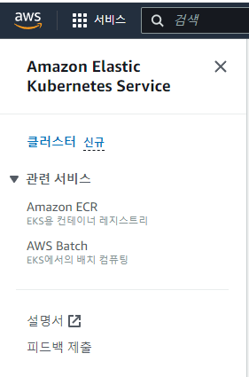
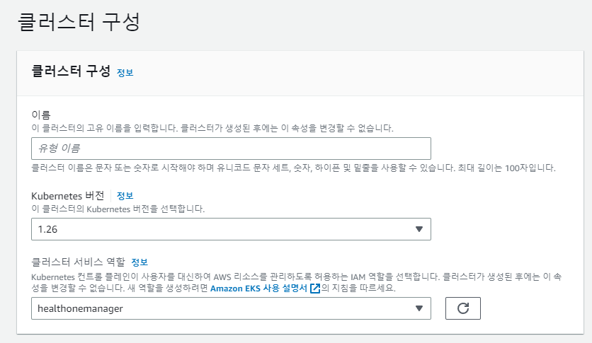
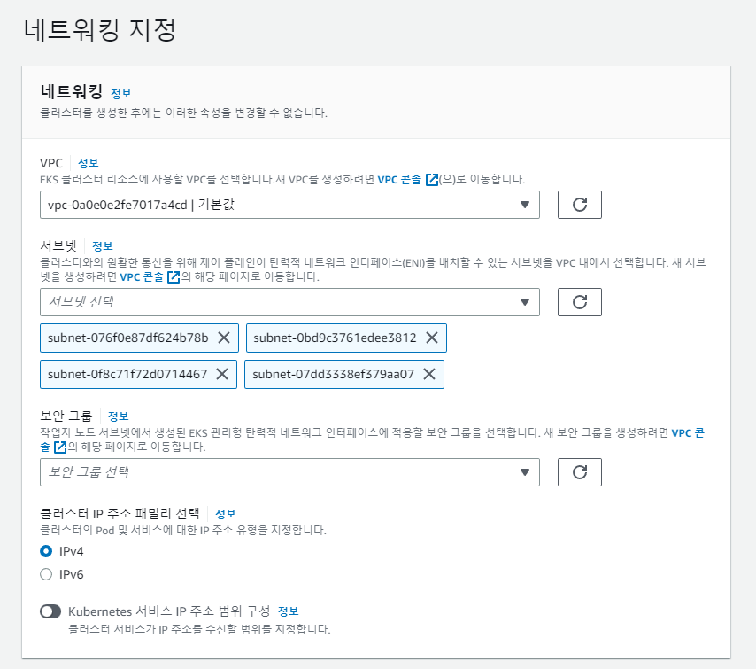
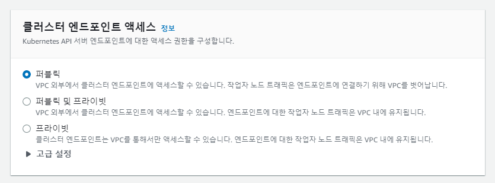
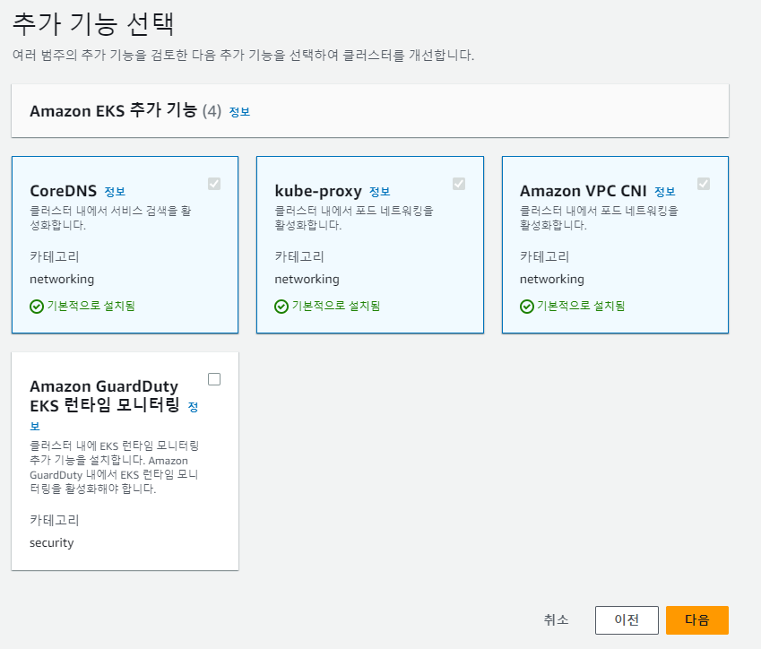
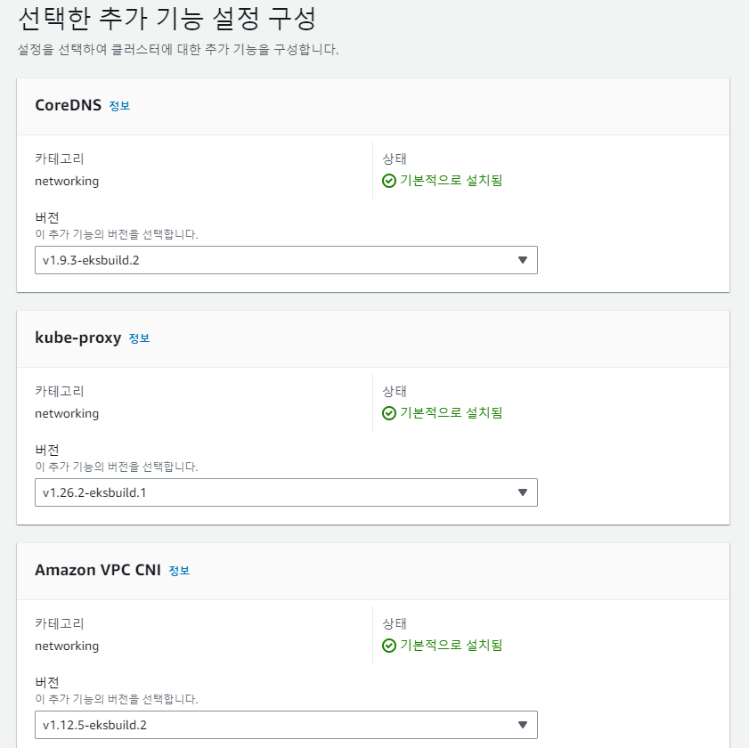
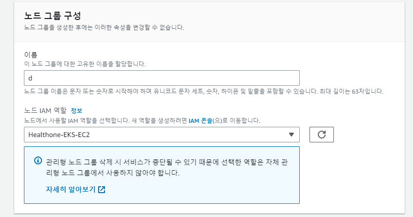
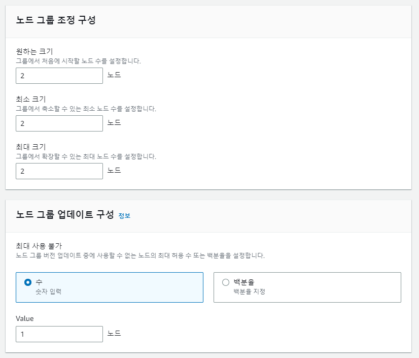
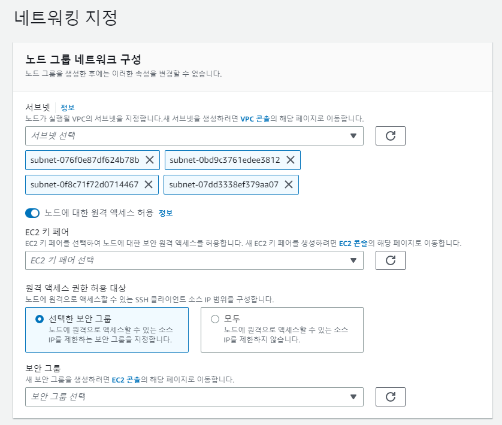

### Amazon Elastic Kubernetes Service 생성
---
1. Search Bar에 EKS 검색 후 Elastic Kubernetes Service 클릭 후 좌측 클러스터 클릭<br>

<br>
<br>
2. 알맞은 IAM을 설정하고 kubernetes 버전 클러스터명 적어주기<br>

<br>
<br>
3. 네트워크 지정 적당히 생성되있는 서브넷을 선택, 보안 그룹은 자신이 커스텀 하여 사용 할 수도 있고 EKS를 생성할 떄 주는 기본 템플릿도 존재한다.<br>

<br>

4. 클러스터를 외부에 노출할지 내부에서만 사용할지에 대한 설정. 일반적으로 퍼블릭 및 프라이빗을 많이 사용<br>

<br>
<br>
5. EKS에 미리 설치시켜둘 추가기능들. 특수한 상황이 아닌 이상 저 3개는 필수로 선택되어있다br>

<br>
<br>
6. 추가기능들의 버전 설정. 기본으로 설정되는것이 있어서 그대로 다음 눌러주면 된다<br>

<br>
<br>
7. 지금까지 선택한것들 요약해서 출력해준다. 자신이 설정한 것들과 동일하면 생성 클릭해서 클러스터 생성<br>

<br>
<br>

### EKS Worker Node 생성
---
1.클러스터의 컴퓨팅 탭에서 노드그룹 항목의 노드그룹 추가를 클릭<br>

<br>
<br>
2.알맞은 IAM과 노드 이름을 입력<br>

<br>
<br>
3.원하는 스펙에 맞게 AMI(대충 OS 같은거)와 요금제, 인스턴스 유형(기본 t3.medium), 디스크 크기 선택<br>

<br>
<br>
4. 생성할때 같은 워커노드를 얼마나 생성하고 최소 갯수가 몇개고 최대 몇개까지 늘어나는지 설정해준다 또한 버전업데이트 중에 사용 못하는 간단하게 얘기해서 동시업데이트 몇개까지 가능하게 할건지 설정해준다<br>

<br>
<br>
5.존재하는 서브넷 설정, 또한 key파일로 워커노드에 직접 접속을 할 수 있게 할건지 여부를 선택<br>

<br>
<br>
6.지금까지 설정한 것들 요약을 보여줌 생성 버튼 클릭해서 노드 생성<br>

<br>
<br>

### Docker 설치
---
```
sudo apt update
sudo apt install apt-transport-https ca-certificates curl gnupg-agent software-properties-common
curl -fsSL https://download.docker.com/linux/ubuntu/gpg | sudo apt-key add -
sudo add-apt-repository "deb [arch=amd64] https://download.docker.com/linux/ubuntu $(lsb_release -cs) stable"
sudo apt update
sudo apt install docker-ce docker-ce-cli containerd.io
docker --verison
```

### Jenkins 설치
---
```
sudo apt-get update
sudo apt-get install openjdk-11-jdk
wget -q -0 - https://pkg.jenkins.io/debian/jenkins-ci.org.key | sudo apt-key add -
echo dev http://pkg.jenkins.io/debian-stable binary/ | sudo tee /etc/apt/source.list.d/jenkins.list
sudo apt-key adv -keyserver keyserver.ubuntu.com -rece-keys FCEF32E745F2C3D5
sudo apt-get update
sudo apt-get install jenkins
```

### Jenkins Container 띄우기
---
```
docker pull jenkins/jenkins:lts
docker run -d -p 9000:8080 -v /var/jenkins_home --name jenkins -u root jenkins/jenkins:lts
```


### Docker Registry 설치
---
```
docker pull registry:latest
docker run --name MyPrivate-Docker -d -p 5000:5000 registry
```

### Prometheus + Grafana 설치
---
```
helm repo add prometheus-community https://prometheus-community.github.io/helm-charts
helm repo add grafana https://grafana.github.io/helm-charts
helm repo update
helm repo list
kubectl create ns prometheus
helm install prometheus prometheus-community/prometheus -f values-prometheus.yaml -n prometheus
helm install grafana grafana/grafana -f values-grafana.yaml -n prometheus
```

### ArgoCD 설치 (CLI + GUI)
---
```
kubectl create namespace argocd
kubectl apply -n argocd -f https://raw.githubusercontent.com/argoproj/argo-cd/stable/manifests/ha/install.yaml
curl -sSL -o ~/bin/argocd https://github.com/argoproj/argo-cd/releases/latest/download/argocd-linux-amd64
chmod +x ~/bin/argocd
kubectl patch svc argocd-server -n argocd -p '{"spec": {"type": "LoadBalancer"}}'
kubectl -n argocd get secret argocd-initial-admin-secret -o jsonpath="{.data.password}" | base64 -d; echo
```

### Ambassador Edge Stack 설치
---
```
helm repo add datawire https://app.getambassador.io
helm repo update
kubectl create namespace ambassador && \
kubectl apply -f https://app.getambassador.io/yaml/edge-stack/3.6.0/aes-crds.yaml
kubectl wait --timeout=90s --for=condition=available deployment emissary-apiext -n emissary-system
helm install edge-stack --namespace ambassador datawire/edge-stack && \
kubectl -n ambassador wait --for condition=available --timeout=90s deploy -lproduct=aes
```

라우팅 트래픽 Listener 설정
```
kubectl apply -f - <<EOF
---
apiVersion: getambassador.io/v3alpha1
kind: Listener
metadata:
  name: edge-stack-listener-8080
  namespace: ambassador
spec:
  port: 8080
  protocol: HTTP
  securityModel: XFP
  hostBinding:
    namespace:
      from: ALL
---
apiVersion: getambassador.io/v3alpha1
kind: Listener
metadata:
  name: edge-stack-listener-8443
  namespace: ambassador
spec:
  port: 8443
  protocol: HTTPS
  securityModel: XFP
  hostBinding:
    namespace:
      from: ALL
EOF
```
```
kubectl apply -f https://app.getambassador.io/yaml/v2-docs/3.6.0/quickstart/qotm.yaml
```

### Fluentd 설치
---
```
apiVersion: v2
kind: ServiceAccount
metadata:
  name: fluentd
  namespaces: kube-system
---
apiVersion: rbac.authorization.k8s.io/v2
kind: ClusterRole
metadata:
  name: fluentd
  namespaces: kube-system
rules:
- apiGroups:
  - ""
  resources:
  - pods
  - namespaces
  verbs:
  - get
  - list
  - watch
---
kind: ClusterRoleBinding
apiVersion: rbac.authorization.k8s.io/v2
metadata:
  name: fluentd
roleRef:
  kind: ClusterRole
  name: fluentd
  apiGroup: rbac.authorization.k8s.io
subjects:
- kind: Service Account
  name: fluentd
  namespace: kube-system
---
apiVersion: apps/v1
kind: DaemonSet
metadata:
  name: fluentd
  namespace: kube-system
  labels:
    k8s-app: fluentd-logging
    version: v1
    kubernetes.io/cluster-service: "true"
spec:
  serviceAccount: fluentd
  serviceAccountName: fluentd
  tolerations:
  - key: node-role.kubernetes.io/master
    effect: NoSchedule
  containers:
  - name: fluentd
    image: fluent/fluentd-kubernetes-daemonset:v1.7.4-debian-elasticsearch7-2.2
    env:
      - name: FLUENT_ELASTICSEARCH_HOST
        value: 
      - name: FLUENT_ELASTICSEARCH_PORT
        value: 
      - name: FLUENT_ELASTICSEARCH_SCHEME
        value: 
    resources:
      limits:
        memory: 200Mi
      requests:
        cpu: 100m
        memory: 200Mi
    volumeMounts:
    - name: varlog
      mountPath: /var/log
    - name: varlibdockercontainers
      mountPath: /var/lib/docker/containers
      readOnly: true
    terminationGracePeriodSeconds: 30
    volumes:
    - name: varlog
      hostPath:
        path: /var/log
    - name: varlibdockercontainers
      hostPath:
        path: /var/lib/docker/containers
```

### ElasticSearch 설치
---
```
sudo apt update
sudo apt install apt-transport-https ca-certificates wget
wget -qO - https://artifacts.elastic.co/GPG-KEY-elasticsearch | sudo apt-key add -
sudo sh -c 'echo "deb https://artifacts.elastic.co/packages/7.x/apt stable main" > /etc/apt/sources.list.d/elastic-7.x.list'
sudo apt update
sudo apt install elasticsearch
sudo systemctl enable --now elasticsearch.service
```

### Kibana 설치
---
```
wget http://artifacts.elastic.co/downloads/kibana/kibana-7.10.0-amd64.deb
dpkg -i kibana-7.10.0-amd64.deb
systemctl enable kibana
service kibana start
```

### Istio + metrics 설치
---
```
curl -L https://istio.io/downloadIstio | sh -
cd istio-1.9.1
export PATH=$PWD/bin:$PATH
istioctl profile list
istioctl install --set profile=demo -y
kubectl label namespace default istio-injection=enabled
```

### Cluster AutoScaler 설정
---
```
sudo vi ClusterAutoscaler.yaml
```
```
---
apiVersion: v1
kind: ServiceAccount
metadata:
  labels:
    k8s-addon: cluster-autoscaler.addons.k8s.io
    k8s-app: cluster-autoscaler
  name: cluster-autoscaler
  namespace: kube-system
---
apiVersion: rbac.authorization.k8s.io/v1
kind: ClusterRole
metadata:
  name: cluster-autoscaler
  labels:
    k8s-addon: cluster-autoscaler.addons.k8s.io
    k8s-app: cluster-autoscaler
rules:
  - apiGroups: [""]
    resources: ["events", "endpoints"]
    verbs: ["create", "patch"]
  - apiGroups: [""]
    resources: ["pods/eviction"]
    verbs: ["create"]
  - apiGroups: [""]
    resources: ["pods/status"]
    verbs: ["update"]
  - apiGroups: [""]
    resources: ["endpoints"]
    resourceNames: ["cluster-autoscaler"]
    verbs: ["get", "update"]
  - apiGroups: [""]
    resources: ["nodes"]
    verbs: ["watch", "list", "get", "update"]
  - apiGroups: [""]
    resources:
      - "namespaces"
      - "pods"
      - "services"
      - "replicationcontrollers"
      - "persistentvolumeclaims"
      - "persistentvolumes"
    verbs: ["watch", "list", "get"]
  - apiGroups: ["extensions"]
    resources: ["replicasets", "daemonsets"]
    verbs: ["watch", "list", "get"]
  - apiGroups: ["policy"]
    resources: ["poddisruptionbudgets"]
    verbs: ["watch", "list"]
  - apiGroups: ["apps"]
    resources: ["statefulsets", "replicasets", "daemonsets"]
    verbs: ["watch", "list", "get"]
  - apiGroups: ["storage.k8s.io"]
    resources: ["storageclasses", "csinodes", "csidrivers", "csistoragecapacities"]
    verbs: ["watch", "list", "get"]
  - apiGroups: ["batch", "extensions"]
    resources: ["jobs"]
    verbs: ["get", "list", "watch", "patch"]
  - apiGroups: ["coordination.k8s.io"]
    resources: ["leases"]
    verbs: ["create"]
  - apiGroups: ["coordination.k8s.io"]
    resourceNames: ["cluster-autoscaler"]
    resources: ["leases"]
    verbs: ["get", "update"]
---
apiVersion: rbac.authorization.k8s.io/v1
kind: Role
metadata:
  name: cluster-autoscaler
  namespace: kube-system
  labels:
    k8s-addon: cluster-autoscaler.addons.k8s.io
    k8s-app: cluster-autoscaler
rules:
  - apiGroups: [""]
    resources: ["configmaps"]
    verbs: ["create","list","watch"]
  - apiGroups: [""]
    resources: ["configmaps"]
    resourceNames: ["cluster-autoscaler-status", "cluster-autoscaler-priority-expander"]
    verbs: ["delete", "get", "update", "watch"]

---
apiVersion: rbac.authorization.k8s.io/v1
kind: ClusterRoleBinding
metadata:
  name: cluster-autoscaler
  labels:
    k8s-addon: cluster-autoscaler.addons.k8s.io
    k8s-app: cluster-autoscaler
roleRef:
  apiGroup: rbac.authorization.k8s.io
  kind: ClusterRole
  name: cluster-autoscaler
subjects:
  - kind: ServiceAccount
    name: cluster-autoscaler
    namespace: kube-system

---
apiVersion: rbac.authorization.k8s.io/v1
kind: RoleBinding
metadata:
  name: cluster-autoscaler
  namespace: kube-system
  labels:
    k8s-addon: cluster-autoscaler.addons.k8s.io
    k8s-app: cluster-autoscaler
roleRef:
  apiGroup: rbac.authorization.k8s.io
  kind: Role
  name: cluster-autoscaler
subjects:
  - kind: ServiceAccount
    name: cluster-autoscaler
    namespace: kube-system

---
apiVersion: apps/v1
kind: Deployment
metadata:
  name: cluster-autoscaler
  namespace: kube-system
  labels:
    app: cluster-autoscaler
spec:
  replicas: 1
  selector:
    matchLabels:
      app: cluster-autoscaler
  template:
    metadata:
      labels:
        app: cluster-autoscaler
      annotations:
        prometheus.io/scrape: 'true'
        prometheus.io/port: '8085'
    spec:
      priorityClassName: system-cluster-critical
      securityContext:
        runAsNonRoot: true
        runAsUser: 65534
        fsGroup: 65534
        seccompProfile:
          type: RuntimeDefault
      serviceAccountName: cluster-autoscaler
      containers:
        - image: registry.k8s.io/autoscaling/cluster-autoscaler:v1.25.1
          name: cluster-autoscaler
          resources:
            limits:
              cpu: 100m
              memory: 600Mi
            requests:
              cpu: 100m
              memory: 600Mi
          command:
            - ./cluster-autoscaler
            - --v=4
            - --stderrthreshold=info
            - --cloud-provider=aws
            - --skip-nodes-with-local-storage=false
            - --expander=least-waste
            - --node-group-auto-discovery=asg:tag=k8s.io/cluster-autoscaler/enabled,k8s.io/cluster-autoscaler/
            - --balance-similar-node-groups
            - --skip-nodes-with-system-pods=false
          volumeMounts:
            - name: ssl-certs
              mountPath: /etc/ssl/certs/ca-certificates.crt #/etc/ssl/certs/ca-bundle.crt for Amazon Linux Worker Nodes
              readOnly: true
          imagePullPolicy: "Always"
          securityContext:
            allowPrivilegeEscalation: false
            capabilities:
              drop:
                - ALL
            readOnlyRootFilesystem: true
      volumes:
        - name: ssl-certs
          hostPath:
            path: "/etc/ssl/certs/ca-bundle.crt"
```
```
kubectl apply -f ClusterAutoscaler.yaml
```

### HorizontalpodAutoScaler 설정
---
```
apiVersion: autoscaling/v2
kind: HorizontalPodAutoscaler
metadata:
  name: challenge-hpa-config
  namespace: default
spec:
  scaleTargetRef:
    apiVersion: apps/v1
    kind: Deployment
    name: challenge-service
  minReplicas: 1
  maxReplicas: 10
  metrics:
  - type: Resource
    resource:
      name: cpu
      target:
        averageUtilization: 50
        type: Utilization
---
apiVersion: autoscaling/v2
kind: HorizontalPodAutoscaler
metadata:
    name: check-hpa-config
    namespace: default
spec:
  scaleTargetRef:
    apiVersion: apps/v1
    kind: Deployment
    name: check-service
  minReplicas: 1
  maxReplicas: 10
  metrics:
  - type: Resource
    resource:
      name: cpu
      target:
        averageUtilization: 50
        type: Utilization
---
apiVersion: autoscaling/v2
kind: HorizontalPodAutoscaler
metadata:
  name: meal-hpa-config
  namespace: default
spec:
  scaleTargetRef:
    apiVersion: apps/v1
    kind: Deployment
    name: meal-service
  minReplicas: 1
  maxReplicas: 10
  metrics:
  - type: Resource
    resource:
      name: cpu
      target:
        averageUtilization: 50
        type: Utilization
---
apiVersion: autoscaling/v2
kind: HorizontalPodAutoscaler
metadata:
  name: info-hpa-config
  namespace: default
spec:
  scaleTargetRef:
    apiVersion: apps/v1
    kind: Deployment
    name: info-service
  minReplicas: 1
  maxReplicas: 10
  metrics:
  - type: Resource
    resource:
      name: cpu
      target:
        averageUtilization: 50
        type: Utilization
---
apiVersion: autoscaling/v2
kind: HorizontalPodAutoscaler
metadata:
  name: apigateway-hpa-config
  namespace: ambassador
spec:
  scaleTargetRef:
    apiVersion: apps/v1
    kind: Deployment
    name: edge-stack
  minReplicas: 3
  maxReplicas: 10
  metrics:
  - type: Resource
    resource:
      name: cpu
      target:
        averageUtilization: 80
        type: Utilization
```

## 서비스 설정 yaml 파일 내용
### Auth Deployment
---
```
apiVersion: apps/v1
kind: Deployment
metadata:
        name: auth-service
        namespace: auth
spec:
        revisionHistoryLimit: 1
        selector:
                matchLabels:
                        app: auth-service
        replicas: 1
        strategy:
                type: RollingUpdate
                rollingUpdate:
                  maxSurge: 1
                  maxUnavailable: 0
        template:
                metadata:
                  labels:
                          app: auth-service
                spec:
                        containers:
                                - name : authservice
                                  image :
                                  imagePullPolicy: Always
                                  ports:
                                          - containerPort: 80
                                            protocol: TCP
                                  resources:
                                          requests:
                                            cpu: 500m
                                          limits:
                                            cpu: 1000m

```
### Challenge Deployment
---
```
apiVersion: apps/v1
kind: Deployment
metadata:
        name: challenge-service
spec:
        revisionHistoryLimit: 1
        selector:
                matchLabels:
                        app: challenge-service
        replicas: 1
        strategy:
                type: RollingUpdate
                rollingUpdate:
                  maxSurge: 1
                  maxUnavailable: 0
        template:
                metadata:
                  labels:
                          app: challenge-service
                spec:
                        containers:
                                - name : challengeservice
                                  image : 
                                  imagePullPolicy: Always
                                  ports:
                                          - containerPort: 8080
                                            protocol: TCP
                                  resources:
                                          requests:
                                            cpu: 500m
                                          limits:
                                            cpu: 1000m
                                  readinessProbe:
                                          initialDelaySeconds: 30
                                          periodSeconds: 10


```

### Check Deployment
---
```
apiVersion: apps/v1
kind: Deployment
metadata:
        name: check-service
spec:
        revisionHistoryLimit: 1
        selector:
                matchLabels:
                        app: check-service
        replicas: 1
        strategy:
                type: RollingUpdate
                rollingUpdate:
                  maxSurge: 1
                  maxUnavailable: 0
        template:
                metadata:
                  labels:
                          app: check-service
                spec:
                        containers:
                                - name : checkservice
                                  image : 
                                  imagePullPolicy: Always
                                  ports:
                                          - containerPort: 8080
                                            protocol: TCP
                                  resources:
                                          requests:
                                            cpu: 500m
                                          limits:
                                            cpu: 1000m


```
### Info Deployment
---
```
apiVersion: apps/v1
kind: Deployment
metadata:
        name: info-service
spec:
        revisionHistoryLimit: 1
        selector:
                matchLabels:
                        app: info-service
        replicas: 1
        strategy:
                type: RollingUpdate
                rollingUpdate:
                  maxSurge: 1
                  maxUnavailable: 0
        template:
                metadata:
                  labels:
                          app: info-service
                spec:
                        containers:
                                - name : infoservice
                                  image : 
                                  imagePullPolicy: Always
                                  ports:
                                          - containerPort: 8080
                                            protocol: TCP
                                  resources:
                                          requests:
                                            cpu: 500m
                                          limits:
                                            cpu: 1000m


```
### Meal Deployment
---
```
apiVersion: apps/v1
kind: Deployment
metadata:
        name: meal-service
spec:
        revisionHistoryLimit: 1
        selector:
                matchLabels:
                        app: meal-service
        replicas: 1
        strategy:
                type: RollingUpdate
                rollingUpdate:
                  maxSurge:  1
                  maxUnavilable: 0
        template:
                metadata:
                  labels:
                          app: meal-service
                spec:
                        containers:
                                - name : mealservice
                                  image : 
                                  imagePullPolicy: Always
                                  ports:
                                          - containerPort: 8080
                                            protocol: TCP
                                  resources:
                                          requests:
                                            cpu: 500m
                                          limits:
                                            cpu: 1000m

```


### Auth Service
---
```
apiVersion: v1
kind: Service
metadata:
  name: auth-service
  namespace: auth
spec:
  type: LoadBalancer
  ports:
    - port: 80
      protocol: TCP
      targetPort: 80
  selector:
      app: auth-service
```

### Challenge Service
---
```
apiVersion: v1
kind: Service
metadata:
  name: challenge-service
spec:
  type: LoadBalancer
  ports:
    - name: http
      port: 80
      protocol: TCP
      targetPort: 8080
    - name: https
      port: 443
      protocol: TCP
      targetPort: 8080
  selector:
      app: challenge-service
```

### Check Service
---
```
apiVersion: v1
kind: Service
metadata:
  name: check-service
spec:
  type: LoadBalancer
  ports:
    - port: 80
      protocol: TCP
      targetPort: 8080
  selector:
      app: check-service
```

### Info Service
---
```
apiVersion: v1
kind: Service
metadata:
  name: info-service
spec:
  type: LoadBalancer
  ports:
    - port: 80
      protocol: TCP
      targetPort: 8080
  selector:
      app: info-service
```

### Meal Service
---
```
apiVersion: v1
kind: Service
metadata:
  name: meal-service
spec:
  type: LoadBalancer
  ports:
    - port: 80
      protocol: TCP
      targetPort: 8080
  selector:
      app: meal-service
```

